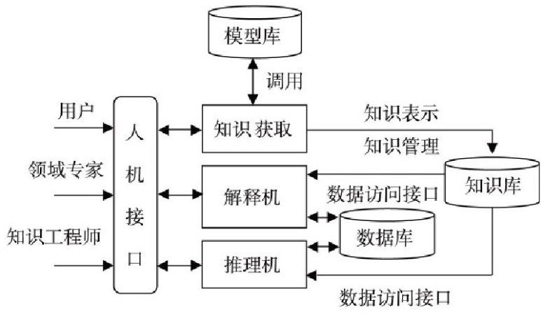
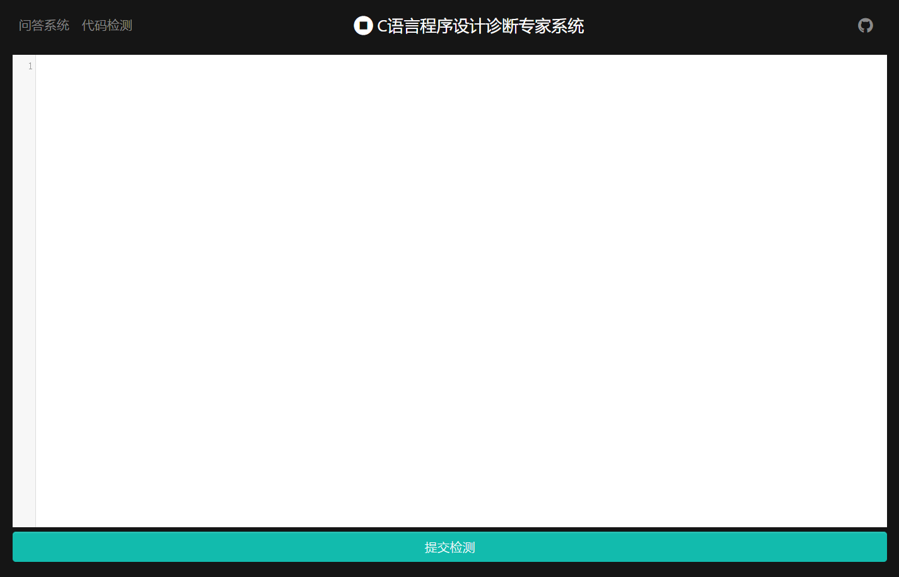
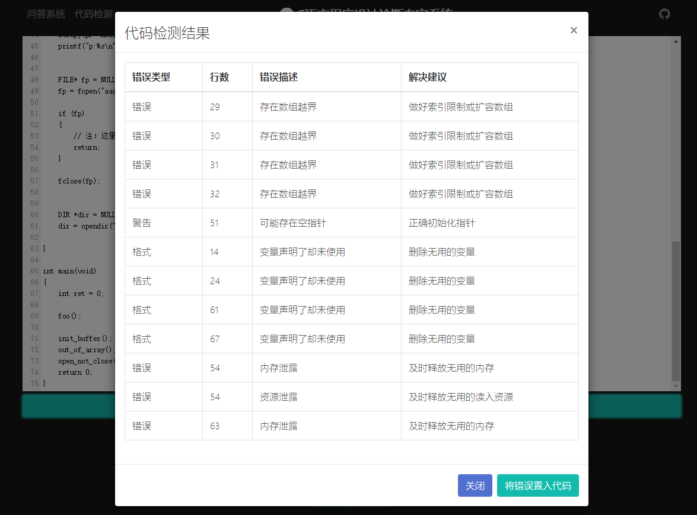

软件学报ISSN 1000-9825, CODEN RUXUEW E-mail: jos\@iscas.ac.cn

*Journal of Software*, [doi: 10.13328/j.cnki.jos.000000] http://www.jos.org.cn

©中国科学院软件研究所版权所有. Tel: +86-10-62562563

C语言程序设计诊断专家系统[^1]

[^1]: ∗ 青海大学计算机技术与应用系人工智能导论课程设计

李怡龙1

1(青海大学 计算机技术与应用系,青海 西宁 810000)

通讯作者: 李怡龙, E-mail: leeli\@live.cn

摘 要:
进几十年来，人工智能技术高速发展，渗透进了各行各业，为各个行业带来了不小得便捷，本文主要概括了人工智能专家系统在C语言程序设计教学中得相关用途，主要着力于代码诊断，包括运行时问题诊断和静态代诊断两个方面，同时也提供了一个快捷得编译错误代码及其解决方法的查询接口。方便初学者快速定位和找到代码问题并提供一定建议。.

关键词: 人工智能;专家系统;C语言;代码诊断;

中图法分类号: TP311

中文引用格式: 李怡龙 .C语言程序设计诊断专家系统.
http://www.jos.org.cn/1000-9825/ 0000.htm

英文引用格式: Li Yilong . C Language Programming Diagnosis Expert System. Ruan
Jian Xue Bao/Journal of Software, 2016 (in Chinese).
http://www.jos.org.cn/1000-9825/0000.htm

C Language Programming Diagnosis Expert System

Li Yilong1

1(Department of Computer Technology and Applications, QingHai University,
QingHai 810000, China)

**Abstract**: In the past decades, the rapid development of artificial
intelligence technology has penetrated into all walks of life, bringing great
convenience to all walks of life. This paper mainly summarizes the application
of artificial intelligence expert system in C language programming teaching,
mainly focusing on code diagnosis, including runtime problem diagnosis and
static generation diagnosis. It also provides a quick query interface for
compiling error codes and their solutions. It is convenient for beginners to
quickly locate and find code problems and provide some suggestions. .

**Key words**: Artificial Intelligence; Expert System; C Language; Code
Diagnosis;

C语言作为很多计算机从业者得入门语言，在初期学习时总会遇到各种各样得问题，就我而言，最初学习C语言时，一多半得时间都用到了百度和Google各类问题上，网上也是很多回答，七嘴八舌，浪费了很多编码得时间，本专家系统则是为了改善这个问题，用户可以通过描述自己的程序运行问题，然后选择对应的操作，系统便能快速为用户显示可能存在的问题。并且针对绝大多数的编译器错误，本系统也能识别并给出解决建议。分析代码问题最直观的便是直接从代码中纠错，本系统基于cppcheck也整合了一套静态代码分析工具，不仅能定位出潜在的问题，同时也能给出一定的解决建议。

本专家系统基于Go语言结合HTML网页技术开发，所有交互都位于网页，方便各类用户使用。.

本专家系统的知识库和推理机基于开源库golog(项目地址：<https://github.com/mndrix/golog.git>)，后端静态分析代码使用开源工具CppCheck(网址：<http://cppcheck.net/>).

Cppcheck是一种C/C++代码缺陷静态检查工具，不同于C/C++编译器及其它分析工具，Cppcheck只检查编译器检查不出来的bug，不检查语法错误。.

Go（又称Golang）是Google开发的一种静态强类型、编译型、并发型，并具有垃圾回收功能的编程语言。.

专家系统设计
============

专家系统的基本结构
------------------

专家系统的基本结构主要包括知识库、数据库、推理机、解释机、知识获取和人机接口
(图1)[1] , 除此6个组成部分外, 还包括一个模型库[2]。模型库可以针对不同的应用领域,
利用相应的理论建立评价模型, 最后归纳到库中[3]。

图1 专家系统的基本结构[4]

本专家系统的知识库构成
----------------------

本系统的知识库主要有有四个：

-   CPPCheck：主要存储CppCheck检查后相关问题的描述，分类及建议解决方法

-   GCC错误代码_解决方案：主要存储相关编译错误代码及其建议解决方法

-   GCC错误代码_中文对照：主要存储相关编译错误代码及其中文对照

-   运行时问题：主要存储运行时问题描述、对应操作及它们之间的逻辑关系

 诊断预测方法
-------------

针对编译器错误代码及CppCheck的相关信息，存储后直接查询即可。并无相关逻辑关系。

针对运行时问题的预测，因为程序错误的特殊性和不确定性，笔者采用顺序询问，取出所有满足条件的信息进行输出。

系统的构成与功能
================

本系统的构成主要分为前后端两大块，前端负责用户输入收集及最终结果的展示。

本系统的功能主要分为两大类，分别未问答系统和代码检测系统。.

系统后端构成
------------

本系统后端基于Go语言开发，主要可以分为三部分

-   HTTP Server

>   HTTP
>   Server基于”net/http”库二次开发，主要包括静态网页提供和相关数据处理，并负责连接前端和其他两部分。

-   Golog知识库及推理

>   该部分负责读取pl文件，进行相关查询等操作

-   .CppCheck交互

>   该部分负责与CppCheck交互并获取返回值，再交由Golog进行二次整理

系统前端构成
------------

本系统前端基于HTML和JavaScript，主要负责数据展示与收集，由三个页面组成:

-   Question.html

>   图2 question.html页面

>   该页面主要提供错误代码查询等服务。

-   Code.html

>   图3 code.html页面

>   该页面提供代码检查服务。

-   Admin.html

>   图4 admin.html

>   该页面提供用户反馈管理服务。

系统功能介绍
------------

### 运行时错误诊断

图5 运行时错误推测结果

选择问题描述及相应操作后点击开始测试按钮即可获得推测结果。

### 错误代码诊断

图6 错误代码诊断

在输入框内输入编译器错误代码后即可获得诊断结果

### 反馈帮助完善知识库

图7 反馈

输入自己的解决方案，来帮助更多人。

### 代码检测

图8 代码检测

将自己的代码粘贴进入编辑框，点击提交检测即可检测代码，获得检测列表或者以注释的形式加入代码的对应位置。

### 管理用户的反馈

图9 管理反馈

在该页面可以管理用户的返回，选择立即集成入知识库还是删除。

总结
====

本系统可以大幅度降低用户的代码纠错难度，同时也提供了一个基于Go语言的专家系统模型供各位参考。因为本人能力有限，无法全面覆盖各个类型的错误，所有目前的知识库相对较小，这就导致了问题预测准确度不足，相信经过后期的进一步维护，可以推出一个完善、简单好用的C语言程序设计专家系统。

.

参考文献:

[1]杨世文.基于人工智能的发射机故障诊断专家系统的应用研究[J].广播电视信息,2019(03):87-90.

[2]汪政宇.人工智能中的医学专家系统[J].科技资讯,2019,17(02):238-239.

[3]马兆彤.分析人工智能在计算机网络技术中的应用[J].电脑迷,2018(10):3.

[4]王会,于栋祯.眩晕疾病人工智能专家诊疗系统研究进展[J].第二军医大学学报,2018,39(08):935-938.
